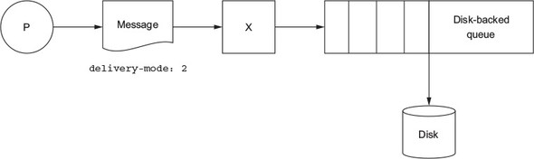
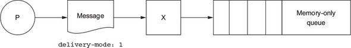

# RabbitMQ: Mejores prácticas de desarrollo

[1. Alcance del documento](#alcance-del-documento)

[2. Colas](#colas)

- [2.1. Siempre mantener las colas pequeñas](#siempre-mantener-las-colas-pequeñas)

- [2.2. Payload - Tamaños y tipos de mensajes](#payload---tamaños-y-tipos-de-mensajes)

[3. Conexiones y canales](#conexiones-y-canales)

- [3.1. Tamaño y numero de paquetes usados en cada acción sobre RabbitMQ](#tamaño-y-numero-de-paquetes-usados-en-cada-acción-sobre-rabbitmq)

- [3.2. No abrir y cerrar conexiones o canales repetidamente](#no-abrir-y-cerrar-conexiones-o-canales-repetidamente)

- [3.3. Separar las conexiones de los publicadores y consumidores](#separar-las-conexiones-de-los-publicadores-y-consumidores)

[4. Acknowledgements y confirmaciones](#acknowledgements-y-confirmaciones)

[5. Mensajes persistentes y colas &quot;durables&quot;](#mensajes-persistentes-y-colas-%26quot%3Bdurables%26quot%3B)

[6. Usar las librerías actualizadas de clientes para RabbitMQ](#mensajes-persistentes-y-colas-%26quot%3Bdurables%26quot%3B)

[7. Usar TTL y Dead lettering con cuidado](#usar-ttl-y-dead-lettering-con-cuidado)

- [7.1. Dead lettering o &quot;carta muerta&quot;](#dead-lettering-o-%26quot%3Bcarta-muerta%26quot%3B)

- [7.2. TTL (Time-to-live o tiempo de vida)](#ttl-(time-to-live-o-tiempo-de-vida))

[8. Recursos](#recursos)

[9. Tutoriales en todos los lenguajes de programación](#tutoriales-en-todos-los-lenguajes-de-programación)

##

##

## Alcance del documento

El propósito de este documento no es definir cada uno de los elementos aquí presentados en su naturaleza ni en su funcionamiento, para ello existe una amplia documentación en abundantes fuentes en todo internet y se hará referencia de las fuentes oficiales en la sección de recursos, si no dar pautas claras y concretas sobre las buenas prácticas a implementar en cada uno de estos elementos.

## Colas

### Siempre mantener las colas pequeñas

Tener muchos mensajes en las colas sin ser procesados genera un alto consumo de memoria RAM, para que esto no se convierta en un impacto grave, RabbitMQ inicia un proceso de paginación llevando estos mensajes encolados a disco, este proceso de paginación toma tiempo y usualmente bloquea la cola para que no procese mensajes cuando hay muchos de estos para paginar, lo que impacta inmediatamente la velocidad de la cola y esto a su vez afecta directamente el performance del broker. Por eso la recomendación es consumir siempre todos los mensajes y no dejar mensajes sin procesar en las colas, esto se logra teniendo un consumidor (en forma de listener) siempre matriculado en la cola y procurando su disponibilidad y correcto funcionamiento todo el tiempo.

### Payload - Tamaños y tipos de mensajes

Si se van a enviar muchos mensajes al tiempo o en serie de forma inmediata a una cola, es mejor empaquetar (bundle) esos múltiples mensajes en uno solo, cuidando que no sean demasiado grandes ni muchos para no afectar el ancho de banda, la velocidad y el tiempo de procesamiento de la cola, y que el consumidor los separe o procese de forma óptima para no afectar el performance de la aplicación. Existe la posibilidad de comprimir los mensajes en base 64 o gzip con la propiedad content-encoding.

##  Conexiones y canales

El protocolo AMQP tiene un mecanismo llamado canales (channels) que &quot;multiplexa&quot; una sola conexión TCP. Se recomienda que cada proceso solo cree estrictamente una única conexión TCP, usando múltiples canales en esa conexión para diferentes subprocesos. Las conexiones deben ser long-live o de larga duración, matriculando listeners y no haciendo consultas directas a la cola.
La mejor práctica: reutilizar las conexiones, que el proceso use su respectiva conexión y canales entre subprocesos, y no compartir canales o conexiones entre procesos, usar un canal por subproceso en su aplicación de lo contrario afectaría el rendimiento de la aplicación y de la cola.

###  Tamaño y numero de paquetes usados en cada acción sobre RabbitMQ

AMQP conexión: 7 paquetes TCP (cerca de 100 KB de RAM, más si se usa TLS)
AMQP canal (channel): 2 paquetes TCP
AMQP publicar: 1 paquete TCP (más para mensajes más largos)
AMQP cerrar canal (channel): 2 paquetes TCP
AMQP cerrar conexión: 2 paquetes TCP
Total 14-19 paquetes (+ Acks)

**Máxima:** Consume (push), don&#39;t poll (pull) for messages.

Asegurarse de que el consumidor consuma mensajes de la cola (push) en lugar de usar acciones de obtención (get) básicas (pull).

reutilizar el mismo canal por hilo para la publicación de mensajes. No abrir un canal cada vez que se quiera publicar.

###  No abrir y cerrar conexiones o canales repetidamente

En los datos anteriormente expuestos se puede ver lo costoso que puede resultar abrir y cerrar conexiones y canales en cada interacción con una cola, por lo tanto, como buena práctica, no se recomienda cerrar ni abrir repetidamente las conexiones y/o los canales a las colas, esto provoca alta latencia y perjudica el performance tanto de la cola como de la aplicación.
La mejor practica: tratar de mantener la conexión o el canal &quot;count low&quot;. Se debe mantener una única conexión por proceso y luego usar un canal por subproceso o hilo en la aplicación, No compartir canales entre hilos o subprocesos, esto afecta el rendimiento de la aplicación.

### Separar las conexiones de los publicadores y consumidores

usar conexiones separadas para el publicador y el consumidor o suscriptor, si se maneja la misma conexión es posible que no se reciban la confirmación de los mensajes entregados o leídos del cliente, esto afecta el performance de la aplicación y la cola

##  Acknowledgements y confirmaciones

Si los mensajes son de alta importancia, use las banderas acknowledgement o confirmación, tanto en el consumidor como en el publicador, haciéndolo siempre después de asegurarse que el mensaje fue leído o publicado respectivamente, esto dependerá de la configuración con la que se solicite la creación de la cola.

##  Mensajes persistentes y colas &quot;durables&quot;

Existen casos especiales donde es imperativo no perder ningún mensaje, por ejemplo en transacciones financieras, en este escenario la cola debe estar configurada como &quot;durable&quot; y el modo de envió en &quot;persistent&quot; (delivery\_mode=2) (ver Figura 1), si no es así, frente a un reinicio de la cola se perderán los mensajes que no se hayan procesado o consumido en ese momento, esto hablando exclusivamente en el entorno y ecosistema donde este la cola alojada o donde resida su broker, no de los sistemas fuera de este entorno. Se debe tener en cuenta que las colas durables y los mensajes persistentes tienen un impacto en el rendimiento pues se bajan a disco, lo mismo ocurre en las lazy queue, por lo tanto, la mejor practica en caso de que no sea imperativo, es usar mensajes en modo transient o transitorios (delivery\_mode=1) (ver Figura 2), de esta manera la velocidad de la cola es mayor y se tendrá un mejor desempeño la aplicación.

Figura 1.

Figura 2.

## Usar las librerías actualizadas de clientes para RabbitMQ

Asegurarse de usar siempre las librerías oficiales y recomendadas más actualizadas para los clientes que se comuniquen con RabbitMQ y cerciorarse de no estar usando librerías en versiones viejas, ya que las librerías actualizadas mejoran el rendimiento y la seguridad de la aplicación donde se implementen, cosa contraria sucede si se usan librerías desactualizadas.

A continuación, se disponen los enlaces de las librerías latest (más actualizadas) de las implementaciones de clientes para Java, .NET y Golang.

Librerías más actualizadas para .NET: [https://github.com/rabbitmq/rabbitmq-dotnet-client/releases/latest](https://github.com/rabbitmq/rabbitmq-dotnet-client/releases/latest)

Librerías más actualizadas para Java: [https://github.com/rabbitmq/rabbitmq-java-client/releases/latest](https://github.com/rabbitmq/rabbitmq-java-client/releases/latest)

Librerías más actualizadas para el cliente de stream de Golang: [https://github.com/rabbitmq/rabbitmq-stream-go-client/releases/latest](https://github.com/rabbitmq/rabbitmq-stream-go-client/releases/latest)

Note que los enlaces anteriormente expuestos, no hacen referencia a una versión especifica de las librerías si no al tag latest del repositorio de GitHub, por lo tanto, siempre llevarán a la última versión de las librerías para cada implementación, en consecuencia, siempre serán vigentes.

##  Usar TTL y Dead lettering con cuidado

###  Dead lettering o &quot;carta muerta&quot;

Una cola que se declara con la propiedad x-dead-letter-exchange enviará mensajes rechazados, anulados o caducados (incluso si tiene TTL o tiempo de expiración) al dead-letter-exchange especificado en esta propiedad. Si se especifica la propiedad x-dead-letter-routing-key, la clave de enrutamiento (routing-key) del mensaje se cambiará cuando tenga cartas muertas.

###  TTL (Time-to-live o tiempo de vida)

Al declarar una cola con la propiedad x-message-ttl, los mensajes se descartarán de la cola si no se han consumido dentro del tiempo especificado en la propiedad, si el proyecto no lo requiere, no es recomendado usar esta propiedad. En el apartado de recursos se disponen enlaces para ampliar la explicación y conocimiento del concepto de TTL.

## Recursos

Que es AMQP
[https://www.amqp.org/about/what](https://www.amqp.org/about/what)

RabbitMQ Tutorials
[https://www.rabbitmq.com/getstarted.html](https://www.rabbitmq.com/getstarted.html)

Que es un canal (channel)
[https://www.rabbitmq.com/channels.html](https://www.rabbitmq.com/channels.html)

Conexión en RabbitMQ
[https://www.rabbitmq.com/connections.html](https://www.rabbitmq.com/connections.html)

Cuál es la relación entre conexiones y canales en RabbitMQ
[https://www.cloudamqp.com/blog/the-relationship-between-connections-and-channels-in-rabbitmq.html](https://www.cloudamqp.com/blog/the-relationship-between-connections-and-channels-in-rabbitmq.html)

Establishing a solid connection to RabbitMQ and long-live connections
[https://subscription.packtpub.com/book/business-and-other/9781789131666/2/ch02lvl1sec13/establishing-a-solid-connection-to-rabbitmq](https://subscription.packtpub.com/book/business-and-other/9781789131666/2/ch02lvl1sec13/establishing-a-solid-connection-to-rabbitmq)

Acknowledgements y confirmaciones
[https://www.rabbitmq.com/confirms.html](https://www.rabbitmq.com/confirms.html)

Fuente principal
[https://www.cloudamqp.com/blog/part1-rabbitmq-best-practice.html](https://www.cloudamqp.com/blog/part1-rabbitmq-best-practice.html)

free ebook: the optimal rabbitmq guide (From Beginner to Advanced)
[https://www.cloudamqp.com/rabbitmq\_ebook.html](https://www.cloudamqp.com/rabbitmq_ebook.html)

RabbitMQ in-depth Book:
[https://livebook.manning.com/book/rabbitmq-in-depth](https://livebook.manning.com/book/rabbitmq-in-depth)

13 errores comunes en RabbitMQ y como corregirlos
[https://www.cloudamqp.com/blog/part4-rabbitmq-13-common-errors.html](https://www.cloudamqp.com/blog/part4-rabbitmq-13-common-errors.html)

When and how to use the RabbitMQ Dead Letter Exchange
[https://www.cloudamqp.com/blog/when-and-how-to-use-the-rabbitmq-dead-letter-exchange.html](https://www.cloudamqp.com/blog/when-and-how-to-use-the-rabbitmq-dead-letter-exchange.html)

Dead Letter Exchanges
[https://www.rabbitmq.com/dlx.html](https://www.rabbitmq.com/dlx.html)

Time-To-Live and Expiration
[https://www.rabbitmq.com/ttl.html](https://www.rabbitmq.com/ttl.html)

Delayed messages with RabbitMQ
[https://www.cloudamqp.com/docs/delayed-messages.html](https://www.cloudamqp.com/docs/delayed-messages.html)

Durability How to survive server failures
[https://www.cloudamqp.com/docs/persistence.html](https://www.cloudamqp.com/docs/persistence.html)

Detecting Dead TCP Connections with Heartbeats and TCP Keepalives
[https://www.rabbitmq.com/heartbeats.html](https://www.rabbitmq.com/heartbeats.html)

## Tutoriales en todos los lenguajes de programación

Repositorio oficial: [https://github.com/rabbitmq/rabbitmq-tutorials](https://github.com/rabbitmq/rabbitmq-tutorials)

Sitio oficial: [https://www.rabbitmq.com/getstarted.html](https://www.rabbitmq.com/getstarted.html)

Implementación en JAVA: [https://www.cloudamqp.com/docs/java.html](https://www.cloudamqp.com/docs/java.html)

Implementación en .NET: [https://www.cloudamqp.com/docs/dotnet.html](https://www.cloudamqp.com/docs/dotnet.html)

Implementación en Python: [https://www.cloudamqp.com/docs/python.html](https://www.cloudamqp.com/docs/python.html)

Implementación en Android: [https://www.cloudamqp.com/docs/android.html](https://www.cloudamqp.com/docs/android.html)

Implementación en Golang: [https://www.cloudamqp.com/docs/go.html](https://www.cloudamqp.com/docs/go.html)

RabbitMQ Best Practice | Webinar with CloudAMQP: [https://tanzu.vmware.com/content/rabbitmq-best-practices/rabbitmq-best-practice-webinar-with-cloudamqp-2](https://tanzu.vmware.com/content/rabbitmq-best-practices/rabbitmq-best-practice-webinar-with-cloudamqp-2)