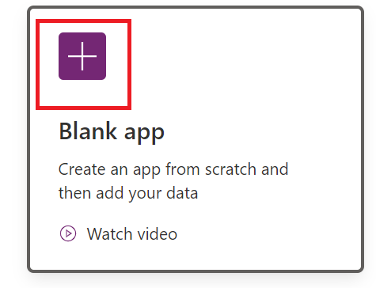
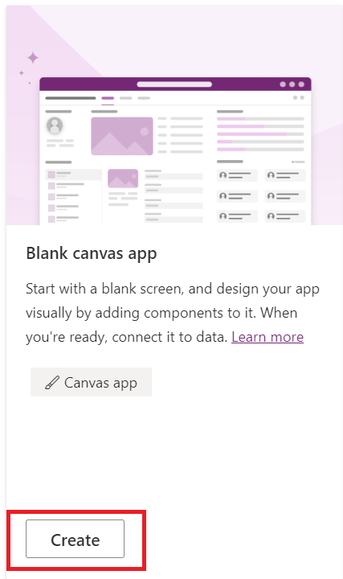
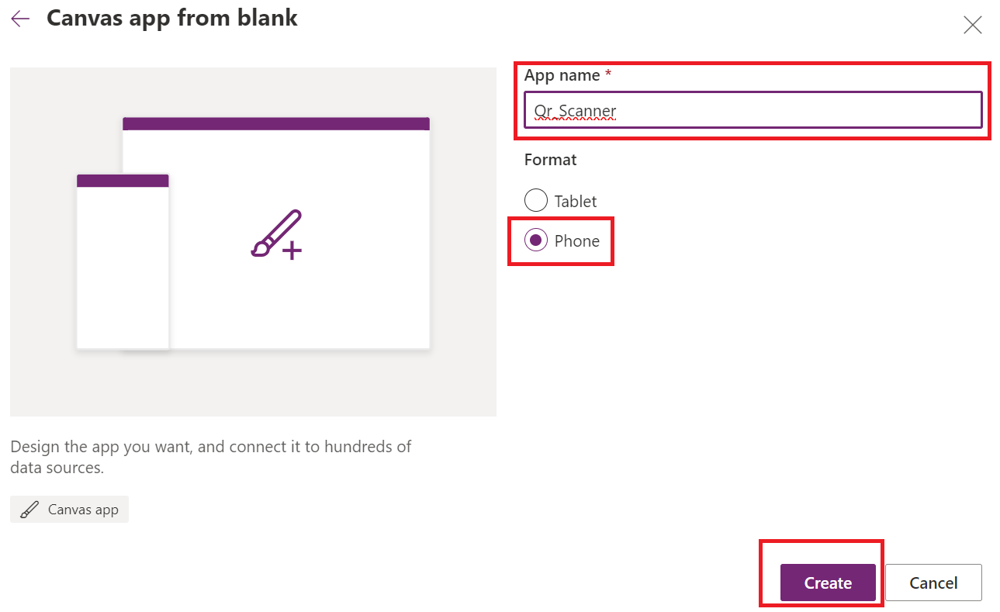
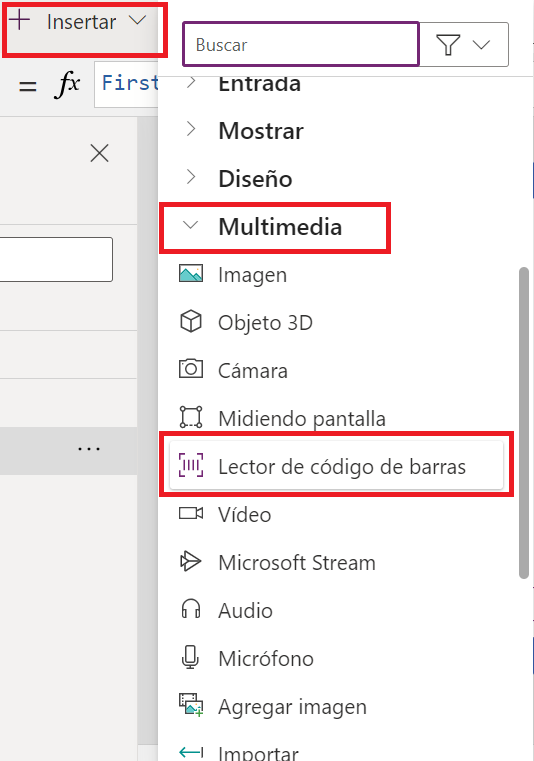
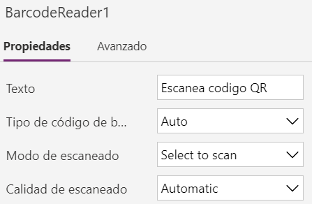

Creamos la aplicacion:

Seleccionamos Blank Canva App:

Seleccionamos la siguiente configuracion:

Insertamos el control de lectura de codigo de barras desde el memu multimedia:

Esta es la configuarion del control:

Label en text: First(BarcodeReader1.Barcodes).Value

Agregamos una base de datos Dataverse cuentas:

y en el campo por defecto nombre de cuenta quedara la informacion que nos de el codigo QR, sea un link, un nombre, un correo o alguna informacion en JSON por ejemplo que pongan en el QR

OnSelect del barcode1: Patch(Cuentas; Defaults(Cuentas); {'Nombre de cuenta':Label3.Text});;

Publicamos y a probar desde nuestro celular.

pueden probarla con esta pagina que permite crear codigos QR con cualquier tipo de informacion: https://qr.io/es/

